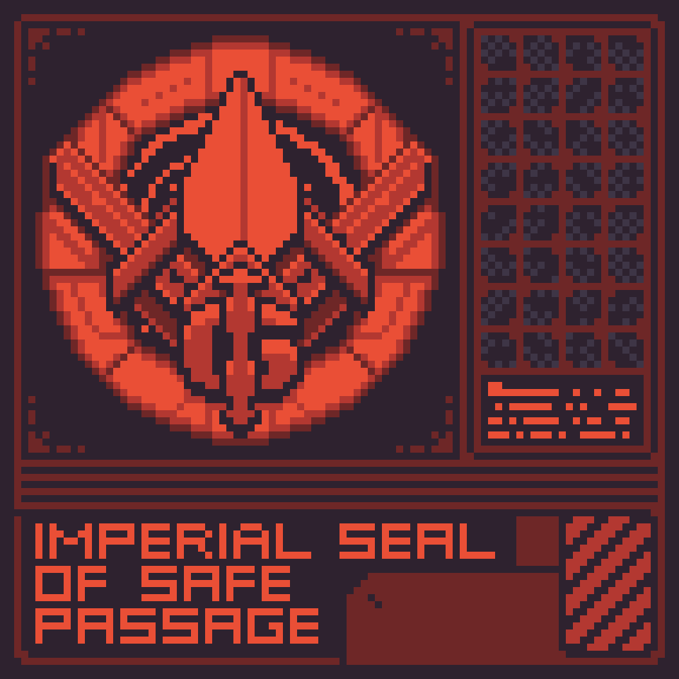

# SkyCutter Peace Treaty

<figure><figcaption></figcaption></figure>

Established between the Imperial Guild and the Ai-Lax leadership, this agreement came into existence following the destruction of and battle over the Olepe Prime and her cargo. The death of so many Ai-Lax and the relentless harassment of the Colonists lead the Guild to agree to provide the Ai-Lax a marginal fraction of a percent profits from their galactic operations, as well as to provide routine missions for them to run into other reaches of the galaxy. In return, the Pirates agreed to permanently remove their blockade around Pytheas, cease all attacks against colonists and workers bearing the Imperial Seal of Safe Passage (ISSP), and to take up their base of operations at any location beyond the orbit of the fourth planet of the Omorphia system. Naturally, the Ai-Lax immediately built bases in the [Vyzallid Asteroid Belt](../universe/aldria-galaxy/sitorian-quadrant/omorphia-system/vyzallid-belt.md). Any overt acts of violence or sabotage by Pirates are deemed to either be dealt with internally by the Pirate Lords themselves, or will be summarily dealt with by the Guild. This is the general outlay of the terms, and they are non-negotiable.
